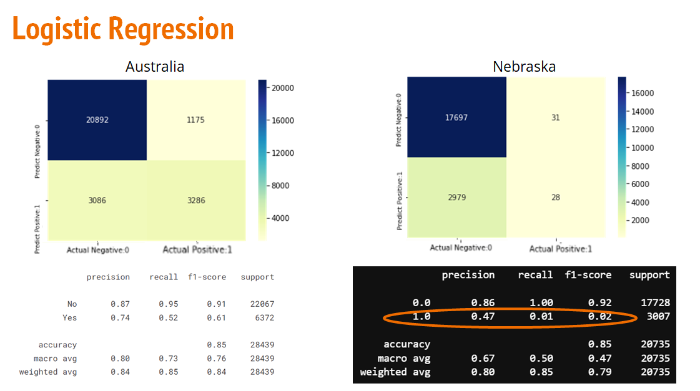

# Comparing Generalizability of Rain Prediction Models for Nebraska and Australia rain data for the last 5 years

Comparing Logitic regression models and ANN models for Nebraska and Australia dataset. 

## Some results from the analysis

